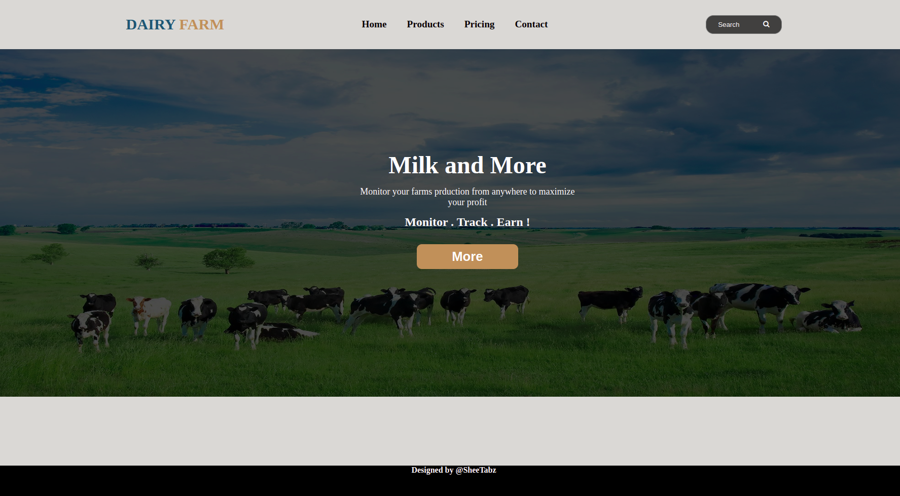
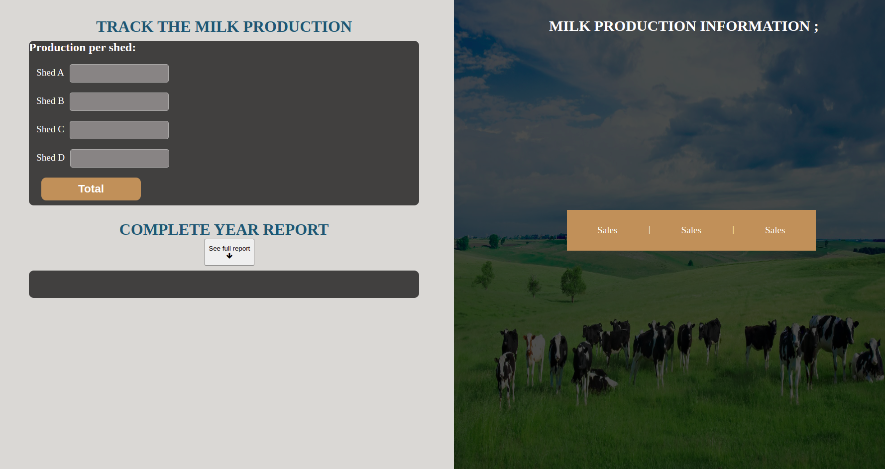
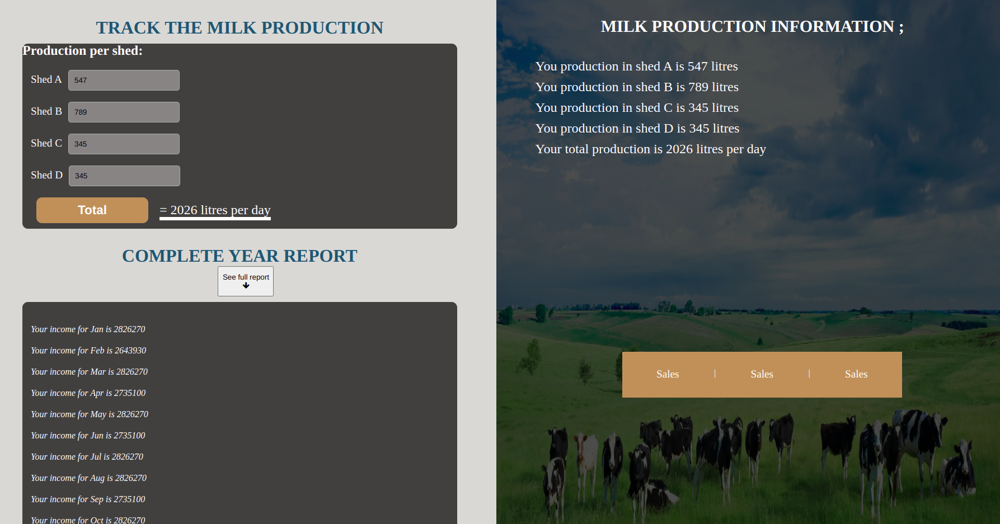

# Dairy Business
***

## Describtion
This is a farm management website

## Demo
Use the link provided to navigate to the AgriPlus website.
[Dairy-Business](https://sheetabz.github.io/dairy-business/)<br>

The page appears as shown below and has the following feaures:
- This the landingpage

- Other pages<br>




## Technologies used & Features
- Well designed and responsive UI
- HTML
- CSS

## Future-implementations 
- JavaScript
- Search APIs

## Contribution
If you need to contribute to this project follow the steps below:<br>
- Clone the repo(`git clone <repo link>`)
- Create a branch where you will add changes (`git branch -b <branchname>`)
- Add the changes (`git add .`)
- Commit changes (`git commit -m"contributing changes"`)
- Push your changes (`git push origin <branchname>`)

## Code Samples
```Html
  <div class="container">
  <!-- NAVIGATION BAR -->
        <div class="container">
       <div class="overlay">
        <div class="homeSection">
            <div class="content">
                <h1>Milk and More</h1>
                <p>Monitor your farms prduction from anywhere to maximize <br>your profit</p>
                <h3 style="font-size: 1.5rem; ">Monitor . Track . Earn !</h3>
                <button><a href="./assets/html/products.html">More</a></button>
            </div>
        </div>
       </div>
    </div>
```
```Css
.container{
    height: 70vh;
    background-image: url("../images/milk3.jpg");
    background-repeat: no-repeat;
    background-size: 100% 100%;

}
.overlay{
    background-color: rgba(0, 0, 0, 0.7);
    width: 100%;
    height: 100%;
    overflow: hidden;
}

.homeSection{
    position: absolute;
    top: 30%;
    left: 40%;
}
```
### Author
[](https://github.com/SheeTabz)<br>
[TABITHA MURIITHI](https://github.com/SheeTabz)

## License information.
### MIT License
[](https://opensource.org/licenses/MIT)  
`[](https://opensource.org/licenses/MIT)`

